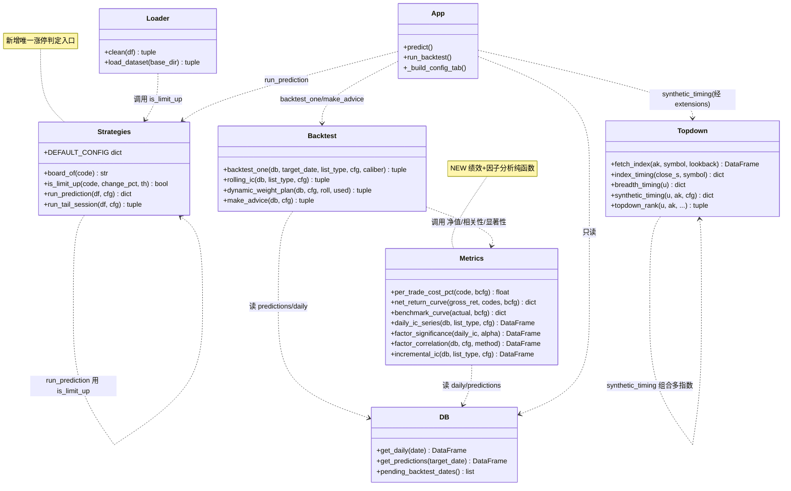
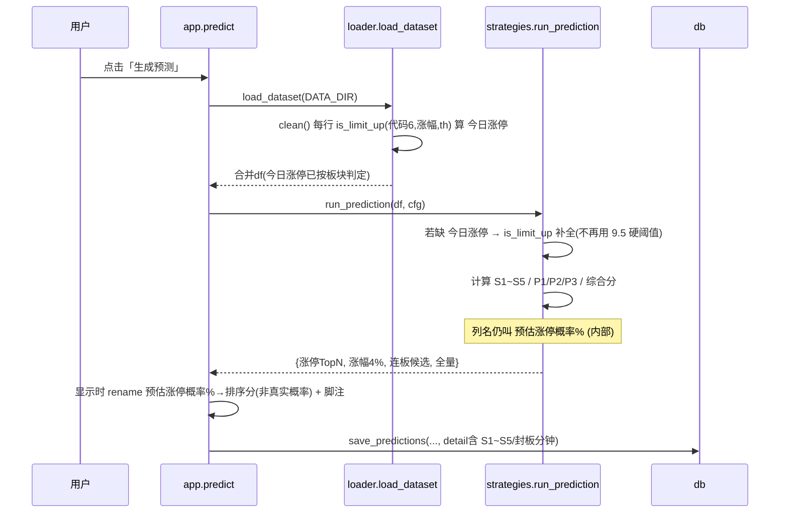
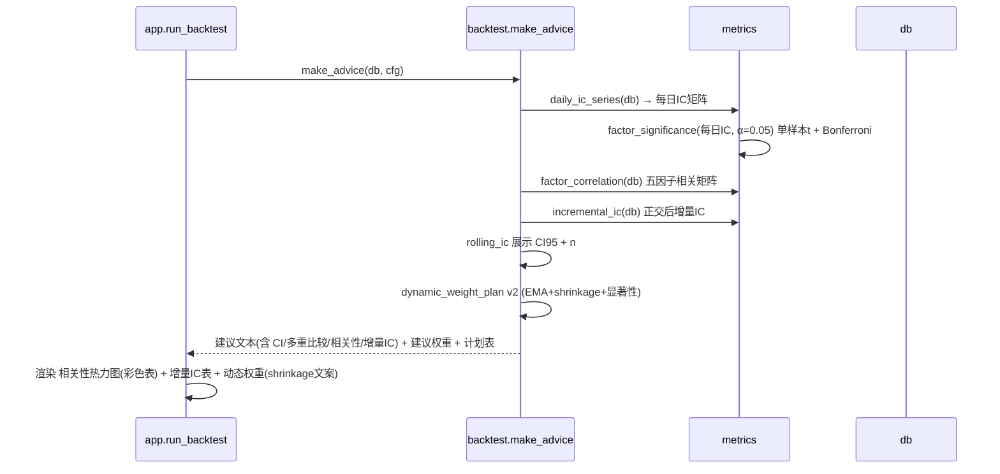
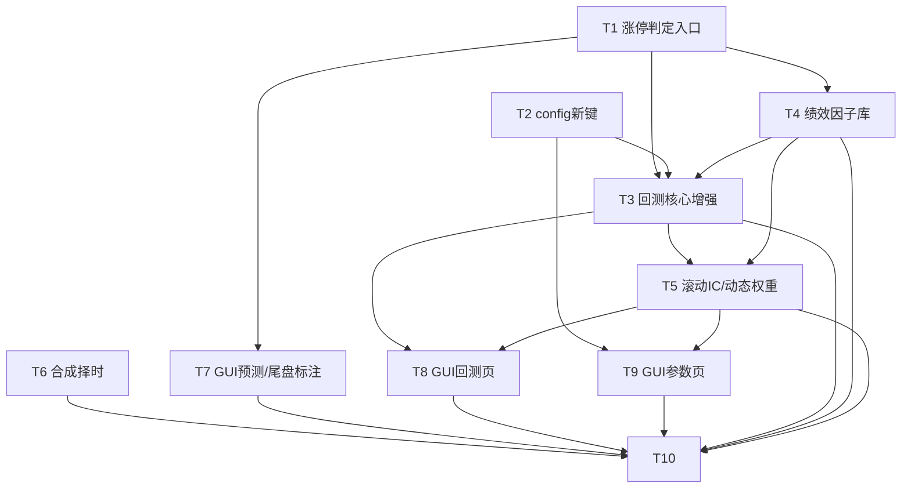

# 涨停预测工具 v2.5 —— P0 缺陷修复 系统架构设计 + 任务分解

> 文档作者：架构师 高见远（software-architect）
> 输入：PM 许清楚《v2.5 优化版 PRD》（已审定，定位升级为 research screen，概率/得分统一标注"排序参考"）
> 范围：仅 P0（8 项纯代码可立即实施的缺陷修复）。P1/P2（含组合层 P1-5）留作后续阶段，本轮**不做**。
> 原则：本轮只改 `core/` 层 + `config.json` + `app.py` 渲染；不破坏 extensions 解耦；core 不反向依赖 extensions；新增 config 键全部向后兼容（缺键回落默认）。

---

## 0. 范围与边界确认

| 项 | 裁定 |
|---|---|
| 本轮做 | P0-1 ~ P0-8 共 8 项缺陷修复 |
| 本轮不做 | P1 / P2 全部（含组合层 P1-5、local 兜底 P1-6 等）；extensions 内部逻辑不动，仅其依赖的 core 接口演化时保持兼容 |
| 定位 | research screen：所有"概率""得分"均标注为**排序参考**，非真实概率、非收益承诺 |
| 数据入口 | 只读 `data.db`（daily / predictions），任何"应用权重"仅在用户显式点击时写入 config.json（禁止自动冻结） |

---

## 1. 实现方案 + 框架选型

### 1.1 技术栈
- 沿用既定栈：**Python + PySide6（GUI）+ pandas + numpy + scipy**（scipy 已用于 Spearman，本轮显著性/增量IC 继续用 scipy）。
- **不引入新硬依赖**。matplotlib / seaborn **仅作可选增强**（用于净值曲线 / 相关性热力图 PNG 导出），缺失时降级为 PySide6 内置彩色表格 + 文本指标，保证离线可运行（详见 §6）。
- 新增一个核心模块 `core/metrics.py`：集中放"绩效指标 + 因子分析"纯函数（净值曲线、Sharpe、最大回撤、胜率、因子相关性、增量 IC、显著性/Bonferroni）。`backtest.py` 调用它，GUI 仅展示。这样既符合"core 不反向依赖 extensions"，又让回测与因子分析解耦、可单测。

### 1.2 难点与对策
1. **P0-7 20cm 误判**：根因是 `涨停判定` 在 3 处硬编码单一阈值 9.5%（`loader.py` L284、`strategies.py` L341/L307）。对策：抽唯一入口 `is_limit_up(code, change_pct, th)` + `board_of(code)`，按代码前缀分判定线（主板 9.5% / 创业板·科创板 19.5% / 北交所 29.5%），三处调用统一替换。
2. **P0-2 回测无净收益**：`backtest_one` 当前只算命中率/涨幅/得分，无成本、无净值。对策：新增成本模型 `per_trade_cost_pct`，按板块分别计双边佣金+印花税+滑点；新增 `metrics.net_return_curve` 产出净值序列 + Sharpe + 最大回撤 + 胜率，并对照"买全部涨停股"基准。
3. **P0-3 收益口径错配**：新增 `caliber` 参数（`close`=T日收盘→T+1收盘全收益；`open`=T+1开盘→T+1收盘含跳空）。口径 B 由 `开盘涨幅`（daily 已映射）推算开盘→收盘收益；单列"一字/秒板无法成交"比例（用 `封板分钟`/现有 `M可买性` 判定），两类口径 GUI 可切换并标注。
4. **P0-1 权重过拟合**：权重加"待验证"标签；回测页策略 IC 表补 **置信区间(CI95) + 样本量 n**；显著性判定加 **Bonferroni 多重比较校正**；**禁止自动冻结**（auto_apply 维持用户显式触发，make_advice 不输出"冻结"字样）。
5. **P0-5 动态权重噪声**：`dynamic_weight_plan` 弃"硬 kill 归零"，改 **shrinkage 向 0 收缩 + 显著性门槛 + EMA 平滑**（EMA 窗口=10，λ=0.3，α=0.05）。
6. **P0-6 因子共线**：新增 `factor_correlation`（五因子 Spearman 相关矩阵，可视化）+ `incremental_ic`（正交后独立增量 IC）；回测/调参建议页并入。
7. **P0-8 择时错配**：`topdown.market_timing` 仅取上证 `sh000001`；新增 `synthetic_timing` 叠加 **中证1000(000852) + 创业板指(399006) + 全市场涨跌家数宽度** 合成宽度信号，L1 默认改走合成信号（失败优雅降级）。
8. **P0-4 概率误导**：GUI 把"预估涨停概率%"等改为"排序分（非真实概率）"，预测页/尾盘页/回测页加脚注。

### 1.3 架构分层（本轮演化）
```
app.py (GUI 渲染/交互)
   │  调用
   ├── core/strategies.py   (因子打分 / is_limit_up / board_of / DEFAULT_CONFIG)
   ├── core/backtest.py     (回测编排: backtest_one / rolling_ic / dynamic_weight_plan / make_advice)
   ├── core/metrics.py      (NEW: 绩效+因子分析纯函数, 被 backtest 调用)
   ├── core/topdown.py      (L1 择时 synthetic_timing / fetch_index 重构)
   ├── core/loader.py       (数据入口: clean 用 is_limit_up)
   └── core/db.py           (SQLite 只读 predictions/daily)
        ↑ 仅被 core 调用，core 不反向 import extensions
extensions/*  (本轮不改逻辑, 仅被动兼容)
```

---

## 2. 文件清单（相对路径 + 函数级改动点）

| 文件 | 动作 | 关键改动点 |
|---|---|---|
| `core/strategies.py` | 改 | ① 新增 `board_of(code)->str`；② 新增 `is_limit_up(code, change_pct, th)->bool`；③ `DEFAULT_CONFIG['thresholds']` 增 `涨停判定涨幅_20cm=19.5`、`涨停判定涨幅_30cm=29.5`；④ `run_prediction` L341 的 `今日涨停` 计算改用 `is_limit_up`；⑤ `run_tail_session` L307 同理 |
| `core/loader.py` | 改 | L284 `out['今日涨停'] = (out['涨幅']>=9.5)` 改为 `out.apply(lambda r: is_limit_up(r['代码6'], r['涨幅'], DEFAULT_CONFIG['thresholds']), axis=1)`（导入 `core.strategies`） |
| `core/metrics.py` | **新** | 纯函数集合：`per_trade_cost_pct`、`net_return_curve`、`benchmark_curve`、`factor_correlation`、`incremental_ic`、`factor_significance`、`daily_ic_series` |
| `core/backtest.py` | 改 | ① `backtest_one` 增 `caliber` 参数 + 成本/净值/无法成交/绩效返回；② `rolling_ic` 增 CI+n（复用 `metrics.factor_significance`/`daily_ic_series`）；③ `dynamic_weight_plan` 重写（shrinkage+EMA+显著性）；④ `make_advice` 增 CI/Bonferroni/相关性/增量IC 段落；⑤ `save_predictions` 的 `detail` 固定键集增 `封板分钟`（供无法成交判定，无表结构变更）；⑥ `STRATEGY_KEYS`/`V2_KEYS` 不变 |
| `core/topdown.py` | 改 | ① 重构 `fetch_sh_index`→泛型 `fetch_index(ak, symbol, lookback)`；② 新增 `index_timing(close_s, symbol)`、`breadth_timing(u)`、`synthetic_timing(u, ak, cfg)`；③ `topdown_rank` 默认走 `synthetic_timing`（cfg 开关，失败降级 `market_timing`） |
| `extensions/topdown_pick.py` | 改(小) | `timing_method` 选项增 `'synthetic'`，`force_method` 透传 `synthetic_timing`；不改选股逻辑 |
| `core/db.py` | 改(小) | 无需改表结构；`get_daily` 已含 `开盘涨幅`/`封板分钟` 等全部 JSON 字段（按需 `merge` 选取） |
| `app.py` | 改 | ① `_build_pred_tab`/`predict`：P0-4 排序分标注 + 脚注；② `_build_backtest_tab`/`run_backtest`：P0-2 净值/Sharpe/回撤/胜率/基准 + 口径 Radio + P0-6 相关性热力图/增量IC 表 + P0-1 CI+n；③ `_build_config_tab`：P0-1 "待验证"标签 + P0-5 显著性开关替代硬kill + 成本/口径/EMA/λ 可编辑；④ `df_to_table`：支持表头别名映射（用于概率→排序分列名显示） |
| `config.json` | 改 | 新增 `backtest_cost`、`timing`、`dynamic_weights.ema_window/shrinkage_lambda/significance_alpha/method`；保持向后兼容 |
| `deliverables/reports/` | 新(运行期) | CSV 落盘：`net_curve_<date>_<list>_<caliber>.csv`、`performance_<date>_<list>_<caliber>.csv`（由 `backtest_cost.report_csv` 控制） |

> 注：所有"展示用"可视化（热力图、净值曲线）优先用 PySide6 内置彩色表格/指标表实现；matplotlib 仅作可选 PNG 增强（见 §6）。

---

## 3. 数据结构与接口（函数签名 + 类图）

### 3.1 新增/改写函数签名

```python
# ---- core/strategies.py ----
def board_of(code: str) -> str:
    """返回 'main'(60/000/001/002/003) | 'cyb'(300/301) | 'star'(688) | 'bse'(8/4/92/920) | 'other'"""

def is_limit_up(code: str, change_pct: float, th: dict) -> bool:
    """唯一涨停判定入口。board_of 决定阈值：main=th['涨停判定涨幅'],
       cyb/star=th.get('涨停判定涨幅_20cm',19.5), bse=th.get('涨停判定涨幅_30cm',29.5)"""

# ---- core/metrics.py ----
def per_trade_cost_pct(code: str, bcfg: dict) -> float:
    """双边成本(小数): 2*commission + stamp_tax + 2*slippage(按板块选 main/20cm)"""

def net_return_curve(gross_ret: pd.Series, codes: pd.Series, bcfg: dict,
                     init_capital: float = 1_000_000) -> dict:
    """等权组合净值。返回 {curve:pd.Series, sharpe:float, max_dd:float,
       win_rate:float, net_return:float, mean_daily:float}"""

def benchmark_curve(actual: pd.DataFrame, bcfg: dict) -> dict:
    """'买全部涨停股'(actual['今日涨停']==True) 等权净值，结构与 net_return_curve 一致"""

def daily_ic_series(db, list_type: str = '涨停TopN', cfg=None) -> pd.DataFrame:
    """date × 五策略 的每日 Spearman IC（来自 backtest_one 的 ic dict）"""

def factor_significance(daily_ic: pd.DataFrame, alpha: float = 0.05) -> pd.DataFrame:
    """对每列做单样本 t 检验(H0:均值IC=0)。返回 策略|均值IC|CI95低|CI95高|
       t|p|Bonferroniα|是否显著|样本天数n。Bonferroni α_b = alpha/列数"""

def factor_correlation(db, cfg=None, method: str = 'spearman') -> pd.DataFrame:
    """跨回测日汇总五因子(S1~S5)相关矩阵（每日截面 corr 后取均值）"""

def incremental_ic(db, list_type: str = '涨停TopN', cfg=None) -> pd.DataFrame:
    """正交后独立增量IC：每日截面以 实际涨幅 为因、其余4因子为自做多元回归得残差，
       再算 该因子 vs 残差 的 Spearman IC；跨日均值。
       返回 因子|IC|增量IC|增量IC_p|独立增量贡献%"""

# ---- core/backtest.py ----
def backtest_one(db, target_date, list_type='涨停TopN', cfg=None, caliber=None) -> tuple:
    """返回 (明细df, 汇总dict, 策略IC dict, 绩效dict)
       明细新增列: 口径收益% , 净收益% , 无法成交(bool), 组合净值(累计)
       汇总新增: 口径, 双边成本%, 无法成交比例, 样本n, 基准净收益%
       绩效dict: net_return_curve 的结构 + bench_return"""

def rolling_ic(db, list_type='涨停TopN', cfg=None) -> tuple:
    """返回 (DataFrame[策略|平均IC|IC>0天数|CI95低|CI95高|样本n|评价], 天数)"""

def dynamic_weight_plan(db, cfg, roll=None, used=None) -> tuple:
    """v2：基于 EMA(窗口=ema_window) 平滑的每日IC + Bonferroni 显著性门槛 + shrinkage(λ)。
       返回 (DataFrame[策略|EMA_IC|p值|是否显著|当前权重%|建议权重%|动作], used天数)。
       动作取值: ✅上调 / ⚠️维持(噪声收缩至地板) / ❌不显著(收缩至地板)，不再出现 '归零(kill)'"""

def make_advice(db, cfg) -> tuple:
    """返回 (建议文本list, 建议权重dict or None, 动态权重计划DataFrame or None)。
       新增段落: 【策略IC显著性(Bonferroni)】【因子相关性(五因子)】【正交后增量IC】"""
```

### 3.2 类图（模块/函数关系）



---

## 4. 程序调用流程（时序图）

### 4.1 预测流（含 P0-7 双判定 + P0-4 排序分）



### 4.2 回测流（含 P0-2 净收益 / P0-3 口径 / P0-1 CI / P0-5 shrinkage）

```mermaid
sequenceDiagram
    participant U as 用户
    participant App as app.run_backtest
    participant BT as backtest.backtest_one
    participant M as metrics
    participant DB as db

    U->>App: 选 目标日+清单+口径(close/open)
    App->>BT: backtest_one(db, date, list, cfg, caliber)
    BT->>DB: get_predictions(target) + get_daily(target)
    BT->>BT: merge(代码6, 涨幅, 开盘涨幅, 今日涨停, detail)
    BT->>BT: 计算 口径收益% (close=涨幅/100; open=(1+涨幅)/(1+开盘涨幅)-1)
    BT->>BT: 标 无法成交 = 一字/秒板(封板分钟<=0.5)→剔除组合
    BT->>M: per_trade_cost_pct(code, bcfg) 逐股双边成本
    BT->>M: net_return_curve(口径收益, codes, bcfg)
    M-->>BT: {curve, sharpe, max_dd, win_rate, net_return}
    BT->>M: benchmark_curve(actual[今日涨停], bcfg)
    M-->>BT: 基准净值/收益
    BT-->>App: (明细df, 汇总[口径,成本%,无法成交比例,n], ic, 绩效)
    App->>App: 展示 净值曲线(可选PNG)+Sharpe+回撤+胜率+基准对照
    Note over App: 口径 Radio 切换只改 cfg['backtest_cost']['caliber']
```

### 4.3 调参建议页数据流（P0-1 / P0-5 / P0-6）



---

## 5. 任务列表（有序、含依赖、可并行、验收点）

> 共 10 个任务。并行说明：T1/T2/T6 无前置可同时开工；T4 依赖 T1；T3 依赖 T1,T2,T4；T5 依赖 T3,T4；T7 依赖 T1；T8 依赖 T3,T4,T5；T9 依赖 T2,T5；T10 收尾集成。

| ID | 名称 | 源文件（改动点） | 依赖 | 优先级 | 可并行 | 验收点 |
|---|---|---|---|---|---|---|
| **T1** | 涨停判定唯一入口（P0-7 基础） | `core/strategies.py`(新增 board_of/is_limit_up + DEFAULT_CONFIG 增 20cm/30cm 阈值)；`core/loader.py`(L284 改用 is_limit_up) | 无 | P0 | 与 T2/T6 并行 | 创业板(300xxx)/科创板(688xxx) 涨幅≥19.5% 判涨停；主板≥9.5%；loader 与 strategies 两处判定一致；`cross_validate` 不受影响 |
| **T2** | config 新增键 + 向后兼容 | `core/strategies.py`(DEFAULT_CONFIG 增 backtest_cost/timing/dynamic_weights 子键)；`config.json`(写入默认) | 无 | P0 | 与 T1/T6 并行 | 旧 config 缺新键时 `load_config` 深合并且回落默认；`backtest_cost.caliber` 默认 'close' |
| **T6** | 合成择时宽度信号（P0-8） | `core/topdown.py`(fetch_index 重构 + index_timing/breadth_timing/synthetic_timing + topdown_rank 默认走 synthetic)；`extensions/topdown_pick.py`(timing_method 增 'synthetic') | 无 | P0 | 与 T1/T2 并行 | synthetic_timing 输出含 sh000001+000852+399006+涨跌家数宽度 四分量；AKShare 失败优雅降级 market_timing；topdown_pick 选股结果不变（仅 L1 coeff 可能变） |
| **T4** | 绩效+因子分析纯函数库 | `core/metrics.py`(NEW: per_trade_cost_pct/net_return_curve/benchmark_curve/daily_ic_series/factor_significance/factor_correlation/incremental_ic) | T1(board_of) | P1 | — | 单测：给定收益序列，Sharpe/最大回撤/胜率数值正确；factor_significance 对 5 列做 Bonferroni；incremental_ic 对角增量最高 |
| **T3** | 回测核心增强（P0-2/P0-3） | `core/backtest.py`(backtest_one 增 caliber/成本/净值/无法成交/绩效；save_predictions detail 增 封板分钟) | T1, T2, T4 | P0 | — | backtest_one 返回净值/Sharpe/回撤/胜率/基准；close 与 open 口径收益不同；一字/秒板从组合剔除且报告比例；成本随板块不同 |
| **T5** | 滚动IC/显著性/动态权重重构（P0-1/P0-5） | `core/backtest.py`(rolling_ic 增 CI+n；dynamic_weight_plan 改 shrinkage+EMA+显著性；make_advice 增 CI/Bonferroni/相关性/增量IC 段落) | T3, T4 | P0 | — | rolling_ic 表含 CI95+n；dynamic_weight_plan 无 '归零(kill)'，改 shrinkage+显著性；make_advice 含相关性矩阵与增量IC 段落；无"冻结"字样 |
| **T7** | GUI 预测/尾盘页排序分标注（P0-4/P0-7） | `app.py`(_build_pred_tab / predict / _build_tail_tab / tail_select / df_to_table 表头别名) | T1 | P0 | 与 T8/T9 部分并行 | 预测页"预估涨停概率%"显示为"排序分（非真实概率）"；页面加脚注；尾盘页同改；可选展示板块列 |
| **T8** | GUI 回测页增强（P0-2/P0-6/P0-1） | `app.py`(_build_backtest_tab / run_backtest：净值曲线+Sharpe+回撤+胜率+基准、口径 Radio、相关性热力图、增量IC 表、CI+n 展示) | T3, T4, T5 | P0 | — | 回测页出现净值曲线(或指标表)+绩效指标+基准对照；口径可切换并标注；相关性彩色热力图+增量IC 表；策略IC 表含 CI+n |
| **T9** | GUI 参数页（P0-1/P0-5 + 成本/口径可编辑） | `app.py`(_build_config_tab / save_cfg：权重"待验证"标签、显著性开关替代硬kill、成本/滑点/口径/EMA/λ 可编辑并落盘) | T2, T5 | P0 | — | 参数页权重旁标"⚠️待验证(回测样本有限)"；硬kill 复选框改为"仅对显著因子调权(Bonferroni)"；新增成本/滑点/口径/EMA窗口/λ 输入且保存生效 |
| **T10** | 落盘 + 端到端集成与兼容校验 | `core/metrics.py`(CSV 导出)、`app.py`(触发导出)、`config.json`(验证)、冒烟脚本 | T3,T4,T5,T6,T7,T8,T9 | P1 | — | 回测结果导出 reports/*.csv；扫描→预测→回测→建议 全链路跑通；旧 config 缺新键不报错并回落默认；`pytest` 现有用例不回归 |

### 5.1 任务依赖图



---

## 6. 依赖包列表

| 包 | 状态 | 用途 | 是否新增 |
|---|---|---|---|
| pandas / numpy / scipy | 已装 | 数据处理、Spearman、t 检验、回归残差 | 否（沿用） |
| PySide6 | 已装 | GUI | 否 |
| **matplotlib**（可选） | 未装 | 净值曲线 / 相关性热力图 PNG 导出（`reports/`） | **可选增强，不强制** |
| **seaborn**（可选） | 未装 | 更美观热力图（依赖 matplotlib） | 可选增强，不强制 |

**裁定**：本轮**不引入任何硬依赖**。所有图表优先用 PySide6 内置 `QTableWidget` 着色（相关性热力图）与 `QTextEdit` 指标表（净值/绩效）实现可视化；若环境已装 matplotlib，则额外导出 PNG 到 `reports/`（代码用 `try/except ImportError` 优雅降级）。理由：打板工具多在离线/内网运行，少一个依赖少一分部署摩擦；彩色表格已能满足"可视"要求。

---

## 7. 共享知识 / 跨文件约定

1. **涨停判定唯一入口**：`is_limit_up(code, change_pct, th)`。`loader.clean` 与 `strategies.run_prediction/run_tail_session` 全部调用它；**禁止**再出现 `df['涨幅'] >= 9.5` 之类硬编码。
2. **板块识别唯一入口**：`board_of(code)`，成本/阈值/判定线统一查它。
3. **成本计算唯一入口**：`metrics.per_trade_cost_pct(code, bcfg)`，按板块选滑点；回测与基准共用，避免口径分裂。
4. **数据唯一入口**：`daily` 表（收盘优先）、`predictions` 表；core 只读，不反向 import extensions。
5. **净值/绩效/因子分析集中 `core/metrics.py`**：`backtest.py` 编排调用，GUI 仅展示，便于单测与复用。
6. **口径(caliber)贯穿**：`backtest_one` / `net_return_curve` / `benchmark_curve` 统一读 `cfg['backtest_cost']['caliber']`；GUI 切换只改此键、不另存副本。
7. **向后兼容铁律**：所有新增 config 键在 `DEFAULT_CONFIG` 给默认值，`load_config` 深合并，缺键回落默认；新增 `detail` 字段为 JSON 扩展（无表结构变更）。
8. **不可变输入 + 禁止自动冻结**：`predictions`/`daily` 只读；任何权重写入 config 仅在用户显式点击"一键应用建议权重"时发生；`make_advice` 不自动落盘权重。
9. **优雅降级**：AKShare 取数失败→宽度代理；`开盘涨幅` 缺失→口径 B 降级为口径 A 并提示；matplotlib 缺失→彩色表。
10. **字段命名**：内部列名保持 `预估涨停概率%` 等不变（避免牵动入库/回测）；仅在 GUI 显示层 `rename` 为"排序分（非真实概率）"，保证 research-screen 定位且不影响下游。

---

## 8. 对 PM 五问的裁定（默认数值 + 理由）

**Q1 默认交易成本与滑点**
> **采纳建议并精确化**。config 键 `backtest_cost`：
> - `commission` = 0.00025（单边万2.5）
> - `stamp_tax` = 0.001（卖出印花税 0.1%）
> - `slippage_main` = 0.001（主板滑点 0.1%）
> - `slippage_20cm` = 0.002（创业板/科创板滑点 0.2%）
> - 双边成本公式 = `2×commission + stamp_tax + 2×slippage`
> - **精确合计**：主板 = 2×0.00025 + 0.001 + 2×0.001 = **0.35%**；20cm = 2×0.00025 + 0.001 + 2×0.002 = **0.55%**。
> - ⚠️ 提示：PM 估算的"主板0.45%/20cm0.65%"略高于按组件精确计算值（差约 0.1%，源于滑点按单边还是双边计）。**本设计以组件精确值 0.35%/0.55% 为准**，全部可配；若主理人坚持 PM 原估计，仅需把 `slippage_main` 调到 0.0015 即可还原 0.45%。请主理人确认采用哪组。
> - 全部置于 `config.json` 可配。

**Q2 动态权重 EMA 窗口 + shrinkage 系数**
> **采纳**。新增 `dynamic_weights.ema_window = 10`（交易日）、`shrinkage_lambda = 0.3`、`significance_alpha = 0.05`。算法：对每日IC做 EMA 平滑 → 单样本 t 检验 + Bonferroni(α/5) 判显著 → 不显著因子 shrinkage 至地板(不再归零) → `w = (1-λ)·max(EMA_IC,0) + λ·0` 再 +地板并归一。理由：EMA 抑噪、shrinkage 避免过拟合尖峰、Bonferroni 防多重比较假显著。

**Q3 净收益曲线/绩效是否落盘 CSV**
> **采纳，是**。受 `backtest_cost.report_csv=true` 控制，回测时导出：`reports/net_curve_<date>_<list>_<caliber>.csv`（日期,净值,日收益,累计收益）、`reports/performance_<date>_<list>_<caliber>.csv`（net_return, bench_return, sharpe, max_dd, win_rate, cost_pct, cant_trade_ratio, n）。

**Q4 组合层(P1-5)本轮是否做**
> **确认不做**。本轮 P0 不含组合层/仓位优化，仅单票排序 + 等权组合净值（用于绩效对照）。组合层留待 P1。

**Q5 原始"缺陷14"缺失**
> **采纳，按 17 项处理，忽略缺失项**。本轮以 PM 审定后的 8 项 P0 为准。

---

## 9. 待明确事项（需主理人/用户拍板）

1. **口径 B 数据可用性**：T+1 开盘口径依赖 daily 含 `开盘涨幅`（loader 已映射，但部分历史 xlsx 可能缺该列）。若缺失，口径 B 降级口径 A 并提示——是否接受此降级策略？还是要求数据侧补齐 `开盘涨幅`？
2. **北交所(30cm, 代码 8/4/92)**：本轮按 `涨停判定涨幅_30cm=29.5%` 保守判定，但样本极少。是否纳入统计/回测？建议：纳入但标注"样本少，结论弱"。
3. **相关性/增量IC 相关方法**：建议 Spearman（因子分有界、非线性、含异常值稳健）。是否同意用 Spearman 而非 Pearson？
4. **动态权重 EMA 状态持久化**：本轮 EMA 仅在单次 `make_advice` 内对已回测日滚动计算（无跨会话状态），保证可复现、无副作用。是否需要跨多次回测会话连续持久化 EMA？（建议：本轮不持久化，保持无状态。）
5. **净值曲线假设**：等权、每日再平衡、初始资金 100 万仅用于展示刻度、成本按 `backtest_cost` 计。是否同意该简化（非真实组合构建）？
6. **matplotlib 可选依赖**：是否允许在部署环境 `pip install matplotlib`（仅用于更美观的 PNG 图表）？不装也能跑（彩色表降级）。

---

## 10. 风险与回归提示

- `loader.clean` 改 `今日涨停` 判定会影响**所有**下游（预测清单、回测、topdown）。T1 必须有单测覆盖 300/688/60/000 各一类样本。
- `detail` 增 `封板分钟` 不破坏旧库（旧 predictions 无此键，读取时 `get` 回落 NaN → 无法成交比例按 `M可买性` 兜底）。
- `dynamic_weight_plan` 语义变更后，旧 `auto_kill_negative=true` 配置需兼容：保留该键但新 `method='shrinkage'` 忽略硬 kill；GUI 复选框文案与行为同步改。
- `synthetic_timing` 联网失败时必须降级，不能让"生成预测/自上而下"因择时崩溃。

---

架构设计已完成
